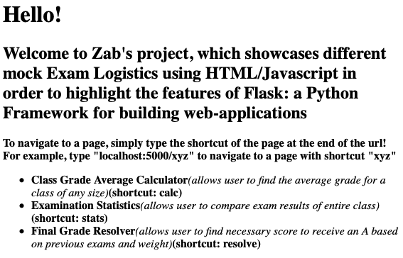
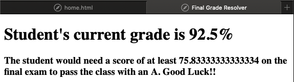
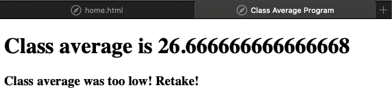
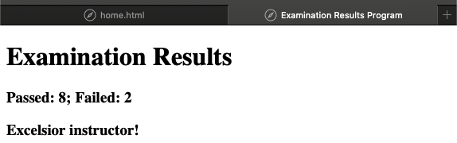
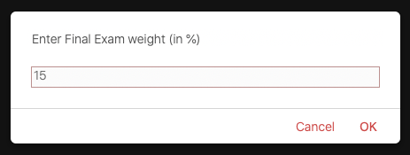
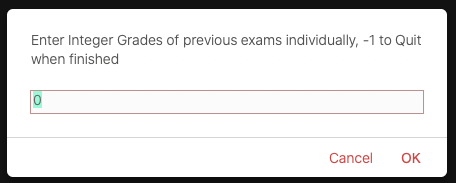

# Python-Flask-Backend-Showcase
This repository is a demonstration of the Flask web framework using the Python language to implement multiple HTML/Javascript webpages into a website.

### SETUP:
1. Download repository into directory which can open a virtual environment. [Click here to learn how to activate Python virtual environments](https://docs.python.org/3/library/venv.html)
2. Activate virtual environment.
3. In virtual environment `export FLASK_APP=PythonFlaskBackendShowcase.py` to create an application discovery for Python and Flask.
4. __DO NOT RUN FLASK!__ This Python code is designed to be executed by python3. *Lines 5, 34, and 35 allow active debugger with lazy loading*
5. Execute code using python3: `python3 PythonFlaskBackendShowcase.py`
6. Flask defaults to localhost 127.0.0.1 Port 500, so enter `http://127.0.0.1:5000/home` to visit home page, then navigate to other pages and use the tools/resources for calculating Exam Logistics!

Sample Images:

